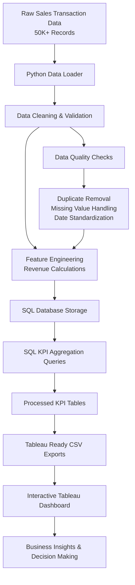

# Sales Performance & Revenue Trend Dashboard

End-to-end data pipeline and analytics workflow for revenue reporting, KPI monitoring, sales performance analysis, and executive decision-making.

## Project Overview

This project simulates a production-style business analytics system. It generates or ingests 50K+ raw sales transactions, cleans and validates the dataset, engineers revenue features, stores curated data in SQLite, calculates KPI data marts, exports Tableau-ready CSVs, and produces business-facing reports.

## Business Problem

Revenue teams need consistent reporting across product, category, region, and sales channel performance. Manual spreadsheet reporting is slow, error-prone, and difficult to audit. This project turns raw sales transactions into repeatable analytics assets that support executive dashboards and operational sales decisions.

## Architecture



## Tech Stack

- Python for orchestration and data processing
- Pandas and NumPy for cleaning, feature engineering, and KPI calculations
- SQLite for local analytical storage
- SQL for schema definition and KPI query documentation
- Tableau-ready CSV exports for dashboard development
- Jupyter Notebook for exploratory data analysis
- Pytest for unit testing

## Folder Structure

```text
sales-performance-revenue-dashboard/
|-- data/
|   |-- raw/
|   |   `-- sales_transactions.csv
|   |-- processed/
|   |   |-- cleaned_sales.csv
|   |   |-- monthly_revenue_summary.csv
|   |   |-- product_performance.csv
|   |   |-- category_performance.csv
|   |   |-- regional_performance.csv
|   |   |-- sales_channel_performance.csv
|   |   `-- dashboard_kpis.csv
|   `-- sample/
|       `-- sample_sales_transactions.csv
|-- database/
|   |-- schema.sql
|   |-- create_tables.sql
|   |-- seed_data.sql
|   `-- kpi_queries.sql
|-- notebooks/
|   `-- exploratory_analysis.ipynb
|-- src/
|   |-- config.py
|   |-- data_loader.py
|   |-- data_cleaning.py
|   |-- feature_engineering.py
|   |-- database_setup.py
|   |-- kpi_calculations.py
|   |-- export_tableau_data.py
|   |-- validation.py
|   `-- main.py
|-- tableau/
|-- reports/
|-- tests/
|-- requirements.txt
|-- README.md
|-- .gitignore
`-- LICENSE
```

## Data Pipeline

1. Load `data/raw/sales_transactions.csv`; if missing, generate a deterministic synthetic dataset with 50,000 realistic sales transactions.
2. Validate required columns and reject empty or malformed inputs.
3. Remove duplicate transactions, standardize dates, normalize business dimensions, validate numeric values, and handle missing values.
4. Engineer revenue features: `gross_revenue`, `discount_amount`, `net_revenue`, `average_order_value`, `transaction_month`, and `transaction_year`.
5. Calculate KPI data marts for monthly revenue, product performance, category performance, regional performance, sales channel performance, and executive KPI cards.
6. Store all curated tables in SQLite and export Tableau-ready CSVs.
7. Generate business summary, KPI report, and insight documentation.

## KPI Definitions

- Total Revenue: sum of `net_revenue`
- Monthly Revenue: sum of `net_revenue` by `transaction_month`
- Monthly Growth %: month-over-month revenue change
- Total Orders: distinct transaction count
- Total Units Sold: sum of `quantity`
- Average Transaction Value: average `net_revenue` per transaction
- Revenue by Product: net revenue grouped by product
- Revenue by Category: net revenue grouped by product category
- Revenue by Region: net revenue grouped by sales region
- Revenue by Sales Channel: net revenue grouped by acquisition or selling channel

## SQL Workflow

- `database/schema.sql` defines the analytical tables and indexes.
- `database/create_tables.sql` creates the SQLite schema.
- `database/seed_data.sql` documents how the Python pipeline loads generated CSV outputs into SQLite.
- `database/kpi_queries.sql` contains reusable aggregation queries for executive KPIs, trends, product ranking, category ranking, regional ranking, and channel performance.

## Tableau Workflow

Use the CSVs in `data/processed/` as Tableau data sources:

- `monthly_revenue_summary.csv`
- `product_performance.csv`
- `category_performance.csv`
- `regional_performance.csv`
- `sales_channel_performance.csv`
- `dashboard_kpis.csv`

The Tableau documentation in `tableau/` defines dashboard requirements, field descriptions, and layout mockups.

## Dashboard Features

- Executive KPI Dashboard: total revenue, growth percentage, average transaction value, total orders, and total units sold.
- Revenue Trend Dashboard: monthly revenue, growth, and seasonality.
- Product Performance Dashboard: top products, units sold, contribution percentage, and revenue ranking.
- Category Dashboard: category comparison and revenue share.
- Regional Dashboard: regional revenue performance and rank.
- Sales Channel Dashboard: online, retail, wholesale, partner, and inside-sales performance.

## How To Run

```bash
pip install -r requirements.txt
python src/main.py
```

Run tests:

```bash
pytest
```

Open the EDA notebook:

```bash
jupyter notebook notebooks/exploratory_analysis.ipynb
```

## Sample Insights

After running the pipeline, see:

- `reports/project_summary.md` for the portfolio-ready project summary
- `reports/business_insights.md` for stakeholder recommendations
- `reports/kpi_report.md` for calculated executive KPIs

Typical analysis questions answered by this project:

- Which products and categories generate the most revenue?
- Which regions and sales channels perform best?
- Which months have the strongest revenue?
- How fast is revenue growing month over month?
- Where should sales leadership focus pricing, inventory, or campaign planning?

## Future Improvements

- Add PostgreSQL and dbt models for warehouse-style deployment.
- Add a scheduled orchestration layer such as Airflow or Prefect.
- Publish a Tableau workbook connected to the processed exports.
- Add customer cohort, retention, and repeat purchase analysis.
- Add margin and profitability fields when cost data becomes available.


